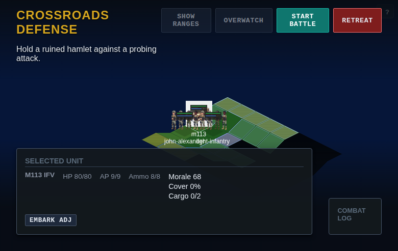

# Spellcross Remake

A modern remake of the classic tactical strategy game Spellcross, built with React, PixiJS, and TypeScript.



## Features

### Strategic Layer
- **Campaign Map**: Conquer territories across Europe
- **Resource Management**: Credits, Research Points, Strategic Points
- **Army Management**: Recruit, refill, and dismiss units
- **Research Tree**: Unlock new unit types and upgrades
- **Save System**: Multiple save slots with auto-save

### Tactical Combat
- **Isometric Hex Grid**: Classic tactical battlefield
- **Turn-Based Combat**: Action points for movement and attacks
- **Unit Variety**: Infantry, vehicles, support units, heroes
- **Combat Mechanics**:
  - Overwatch (reaction fire)
  - Cover system
  - Morale and experience
  - Ammunition management
  - Transport (embark/disembark infantry)
- **AI Opponent**: Configurable difficulty levels

### Unit Types
| Type | Examples | Role |
|------|----------|------|
| Infantry | Light Infantry, Rangers | Versatile ground troops |
| Vehicle | M113 IFV, Leopard 2 MBT | Heavy firepower, transport |
| Support | Field Medic | Healing and buffs |
| Hero | Captain John Alexander | Elite unit with special abilities |

## Tech Stack

- **Frontend**: React 18 + TypeScript
- **Graphics**: PixiJS 7 with @pixi/react
- **Build**: Vite
- **Monorepo**: pnpm + Turborepo
- **Testing**: Vitest (unit), Playwright (e2e)

## Project Structure

```
spellcross/
├── apps/
│   └── web/                 # Main game application
│       ├── src/
│       │   ├── App.tsx      # Main app component
│       │   ├── components/  # React components
│       │   └── services/    # Game services
│       ├── public/          # Assets (textures, sprites)
│       └── e2e/             # Playwright tests
├── packages/
│   ├── core/                # Game logic & simulation
│   ├── data/                # Game data (units, research, etc.)
│   ├── services/            # Backend services
│   └── config/              # Shared configuration
└── docs/                    # Documentation
```

## Getting Started

### Prerequisites

- Node.js 18+
- pnpm 8+

### Installation

```bash
# Install dependencies
pnpm install

# Start development server
pnpm dev
```

The game will be available at `http://localhost:5173`

### Build

```bash
# Build all packages
pnpm build
```

### Testing

```bash
# Run unit tests
pnpm test

# Run e2e tests
pnpm e2e
```

## How to Play

1. **Start a New Game**: Select a save slot from the main menu
2. **Strategic HQ**:
   - View the campaign map
   - Manage your army (recruit, refill units)
   - Research new technologies
   - Select a territory to attack
3. **Tactical Battle**:
   - Deploy your units in the starting zone
   - Click "Start Battle" to begin
   - Click on tiles to move units
   - Click on enemies to attack (double-click or use attack button)
   - Use "Overwatch" for reaction fire
   - Click "End Turn" when done

### Controls

| Action | Control |
|--------|---------|
| Select unit | Click on unit |
| Move | Click on destination tile |
| Attack | Click on enemy (shows attack panel) |
| Confirm attack | Click "ATTACK" button |
| End turn | Click "End Turn" button |

## Screenshots

### Main Menu


### Strategic HQ


### Tactical Battle


## Development

### Adding New Units

Units are defined in `packages/data/src/index.ts`. Each unit has:
- Stats (HP, movement, attack power)
- Weapons with ranges
- Faction assignment
- Unlock requirements

### Adding New Territories

Territories are defined in the campaign data. Each territory includes:
- Map position
- Difficulty rating
- Mission objectives
- Enemy composition

## Credits

- Inspired by the original **Spellcross** (1997) by Cauldron
- Built with modern web technologies

## License

MIT License - See [LICENSE](LICENSE) for details
